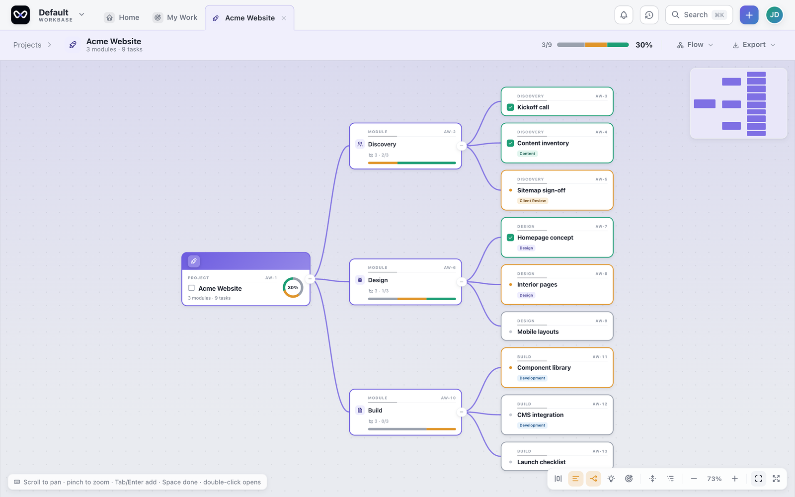
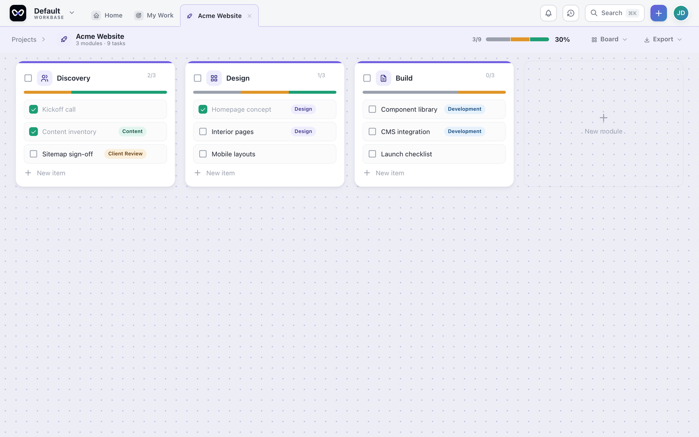
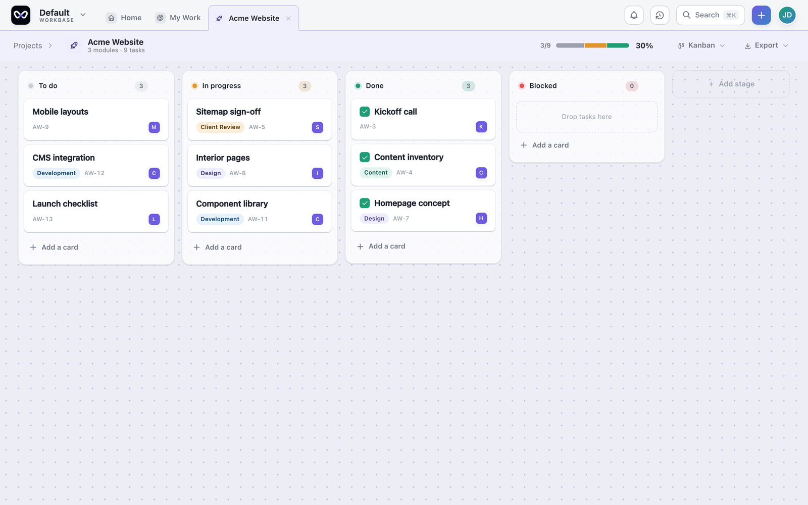
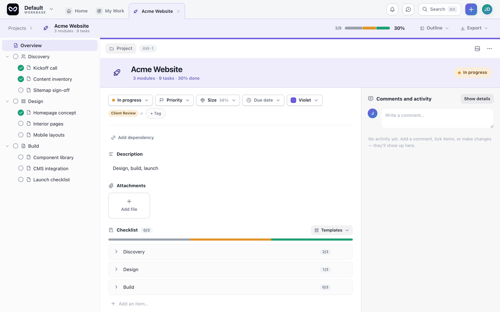
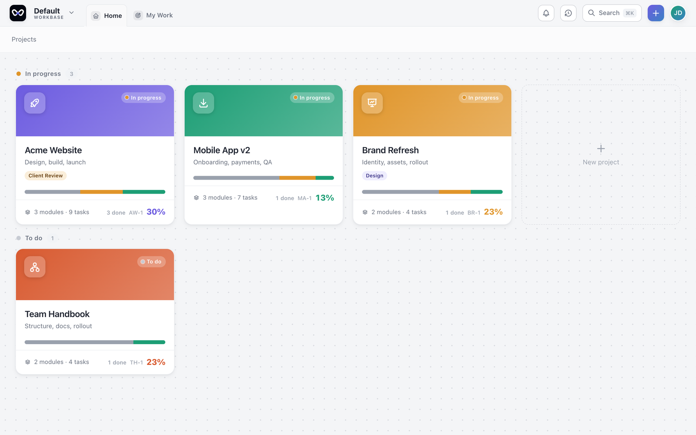
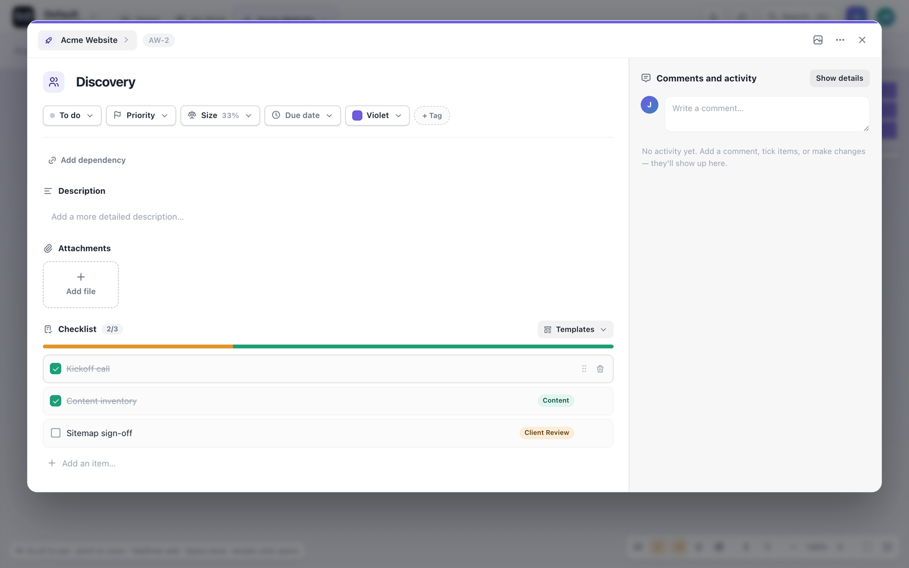
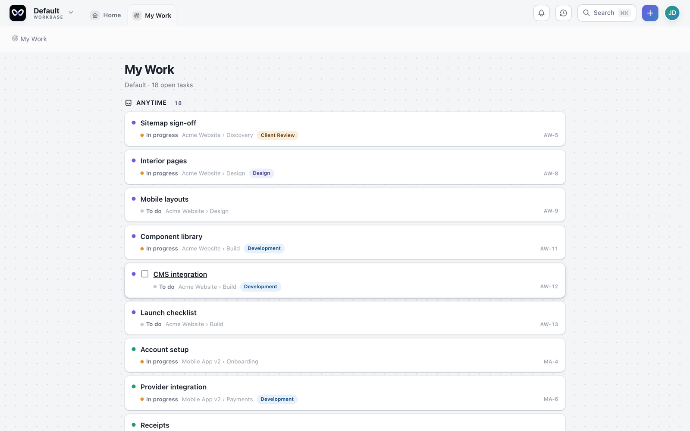
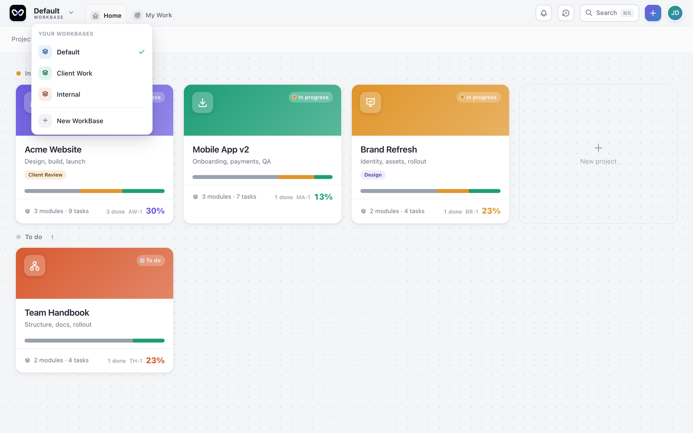
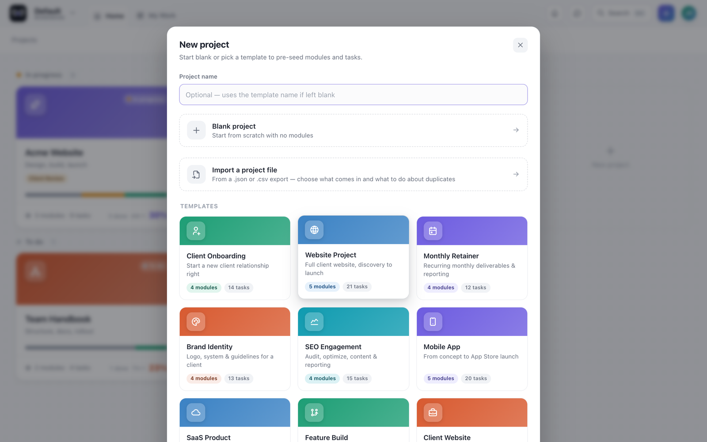
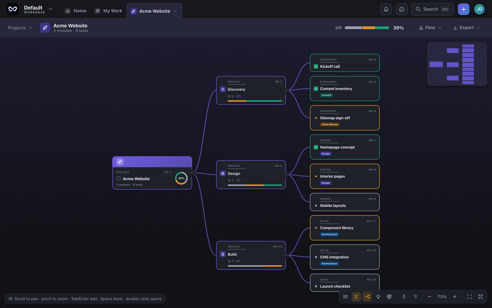

<div align="center">

# WorkBase

**A local-first, open source project manager for people who think in trees, not columns.**

An offline desktop alternative to Trello, Asana and Monday — free, AGPL-licensed,
and your data never leaves your machine.

[Flow view](#flow-view) · [Screenshots](#the-four-views) · [Working in it](#working-in-it) · [Install](#install) · [Build from source](#build-from-source) · [Licence](#licence)

</div>

---

Kanban boards are good at showing *what is in progress* and bad at showing *how the work
fits together*. A board flattens a project into columns. Real projects are nested — a
project has modules, modules have tasks, tasks have subtasks, and some of those go four
levels deeper.

WorkBase keeps the board and adds a **flow view**: the whole project as a tree you can
explore at any depth.

Everything is stored on your own disk. No account, no server, no telemetry, no network
call. That isn't a promise you have to take on faith — the source is here, and the
desktop build's content-security policy allows no external origins at all.

## Flow view

The reason this exists.



- **Unlimited nesting.** Project → module → task → subtask → as deep as the work goes.
- **Progress rolls up, weighted.** A parent shows the progress of everything beneath it,
  so you can see where a project is stuck without opening anything. Above, three modules
  at 2/3, 1/3 and 0/3 roll into 30% at the root.
- **Complete in place.** Tick items off in the tree. No modal, no context switch.
- **Toggleable detail.** Collapse to titles for the shape of the project; expand for the
  detail, one level at a time.
- **It warns, it doesn't block.** Completing a parent with unfinished children raises a
  flag and offers to complete the children too — then gets out of your way.

The reasoning behind the rollup — how weights are chosen, why completion is never
automatic, how health and staleness are derived — is written up in
[docs/design](docs/design/2026-08-19-computed-status-and-weighted-rollup-design.md).

## The four views

Four views over the same data. Switch freely; nothing is a separate document.

### Board — modules side by side



### Kanban — by stage, with drag and drop



### Outline — tree on the left, full detail on the right



### Projects home — every project with its rolled-up progress



## Working in it

### Any item opens for detail — and takes sub-items of its own

Status, priority, size, due date, colour and tags; dependencies; a description;
attachments; a checklist you can keep adding sub-items to, seeded from a template if you
want one; and a comment and activity trail. Nesting is not limited to the tree — a
checklist item is just another child.



### My Work — everything due, across every project

One list, pulled from every project in the WorkBase, each item showing the path it came
from.



### Multiple WorkBases

Keep client work, internal projects and personal things in separate WorkBases and switch
between them. Each has its own projects, tags and stages.



### Fifteen templates to start from

Client onboarding, website project, monthly retainer, brand identity, SEO engagement,
mobile app, SaaS product and more — each pre-seeded with modules and tasks. Or start
blank, or import a `.json`/`.csv` export.



### Dark mode



## Everything else

Multiple WorkBases · 15 project templates · dependencies with blocked-state propagation ·
full-text search · a My Work view across every project · tags, sizes and due dates ·
light and dark themes · export to **PNG, PDF, Markdown, CSV and JSON** · local-only
storage · macOS and Windows.

**Deliberately not here:** no Gantt charts (probably ever), no calendar view yet, no web
version, no accounts.  These are choices, not a backlog.

## Install

**macOS** — [download the signed universal DMG](https://github.com/vocso-com/WorkBase/releases/latest)
(Apple Silicon and Intel). It is signed with VOCSO's Developer ID and notarised by Apple,
so it opens without a Gatekeeper warning.

**Windows and Linux** — no installers yet. Build from source below; it takes about five
minutes. [Watch releases](https://github.com/vocso-com/WorkBase/releases) to hear when
they land.

## Build from source

You need **Node 20+** and **Rust** (stable). Install the
[Tauri prerequisites](https://tauri.app/start/prerequisites/) for your platform first —
that's Xcode Command Line Tools on macOS, and the Microsoft C++ Build Tools plus the
WebView2 runtime on Windows.

```bash
git clone https://github.com/vocso-com/WorkBase.git
cd WorkBase
npm install
npm run tauri dev
```

### Building installers

**macOS** — produces a `.dmg` and `.app` under `src-tauri/target/release/bundle/`:

```bash
npm run tauri build
```

For a universal binary that runs on both Apple Silicon and Intel:

```bash
npm run tauri build -- --target universal-apple-darwin
```

Unsigned builds trigger Gatekeeper. To sign and notarise, set `APPLE_ID`,
`APPLE_TEAM_ID` and `APPLE_PASSWORD` (an app-specific password) and run
`./scripts/release.sh`, which signs, notarises and staples the DMG in one step. You will
need your own Apple Developer account and a Developer ID certificate in your keychain.

**Windows** — produces an NSIS `.exe` installer under
`src-tauri/target/release/bundle/nsis/`:

```bash
npm run tauri build -- --bundles nsis
```

**Linux** — Tauri renders through WebKitGTK, so install its development packages first
(Debian/Ubuntu shown; the equivalents exist on other distributions):

```bash
sudo apt install libwebkit2gtk-4.1-dev libappindicator3-dev librsvg2-dev \
  patchelf libxdo-dev build-essential file
npm run tauri build -- --bundles appimage,deb
```

That leaves an `.AppImage` and a `.deb` under `src-tauri/target/release/bundle/`.

Tauri cannot cross-compile to Windows from macOS or Linux, so this must run on Windows.
If you'd rather not keep a Windows machine, `.github/workflows/release.yml` builds both
platforms on GitHub-hosted runners — push a `v*` tag and it produces a macOS `.dmg` and a
Windows `.exe`, runs the test suite first, and attaches them to a draft release. Windows
builds there are unsigned, so SmartScreen asks users to click through
"More info → Run anyway"; the macOS one is unsigned too, which is why the signed DMG for a
real release comes from `scripts/release.sh` on a machine with the certificate.

### Development

```bash
npm run dev        # web build at localhost:1420, data in IndexedDB
npm test           # vitest — 291 tests
npm run typecheck  # tsc --noEmit
npm run build      # production web build
```

`npm install` also points git at `.githooks`, which adds a pre-commit scan for
credential-shaped strings and environment files.

## Where your data lives

| Build | Location |
| --- | --- |
| Desktop | A JSON document in the OS application-data directory |
| Web/dev | IndexedDB on that device |

Nothing is uploaded. Export everything at any time from **About → Export your data**.

Persistence sits behind a two-method interface in
[`src/lib/storage.ts`](src/lib/storage.ts) — `load()` and `save()`. The app ships a Tauri
filesystem adapter and an IndexedDB one and picks between them at startup. If you want
the document to live somewhere else, that's the seam.

## Free vs paid

**Everything that runs on your machine is free forever and complete. Things that cost
money to operate are paid.**

That's the whole rule. Sync and collaboration need servers, storage and bandwidth — real
cost, every month, per user. Local features cost nothing to run, so charging for them
would be rent, not payment.

Sync and collaboration are planned, and they will be paid. Saying so now rather than
surprising you later. What it will never mean:

- **No feature you can use today ever moves behind a paywall.** No project caps, no task
  caps, no nesting limits, no watermarks.
- **Flow view stays free.** The reason to use WorkBase is not going to become the upsell.
- **The local app never needs an account, and never makes a network request.**
- **Your data stays portable.** JSON and Markdown export stay free and complete. If you
  leave, you leave with everything.

## Licence

[AGPL-3.0](LICENSE).

Use it for anything including commercially, read and modify the source, redistribute it.
If you distribute a modified version it must also be AGPL. **If you run a modified
version as a network service, you must publish your changes** — that's section 13, and
it's the reason for AGPL over MIT: nobody can take WorkBase, add sync, and sell it as a
closed service.

For a local desktop app section 13 never triggers, so day to day this behaves like
GPL-3.0. A commercial licence is available if AGPL doesn't work for you — open an issue.

The licence covers the source. The WorkBase and VOCSO names and logos are trade marks —
see [TRADEMARK.md](TRADEMARK.md). Forks are welcome; please pick your own name and mark.

## Contributing

Open an issue before writing anything substantial — WorkBase has opinions about what it
is, and it'd be a bad outcome for you to spend a weekend on something that gets declined
on principle.

Two things that will always be declined: **any network call from the local app**, and
**sync or collaboration built into this repo**. The first breaks the only claim the
product rests on. The second is planned as a paid service.

Please run `npm test` and `npm run typecheck` before opening a PR. External pull requests
need a contributor licence agreement signed before merging — ask in an issue and we'll
sort it out.

## Security

Found a vulnerability? Please don't open a public issue — report it through
[GitHub Security Advisories](https://github.com/vocso-com/WorkBase/security/advisories/new).

## Who builds this

WorkBase is built and maintained by **[VOCSO Technologies Pvt Ltd](https://www.vocso.com)**,
an ISO 27001-certified software development company founded in 2009, with teams in
Faridabad (India), Orange (California) and Dubai.

VOCSO builds software for clients across product engineering, custom web and mobile
application development, and AI development — RAG systems, NLP and generative AI
features. WorkBase started as an internal tool for tracking our own client projects,
which is the reason it is shaped the way it is: agencies run many nested projects at
once, and no column-based board survives that.

If your team needs something like this built, [get in touch](https://www.vocso.com).

---

<div align="center">

Built by [VOCSO Technologies](https://www.vocso.com) — Faridabad · California · Dubai

</div>
